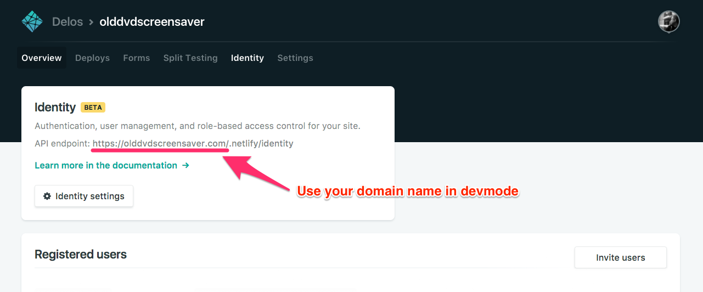

# Netlify Gocommerce Widget

```
Warning!! This is still Work in Progress.

Not ready for general use yet.
```

A component used to add a gocommerce powered shopping cart.
[Live demo](https://gocommerce-widget.netlify.com)

For a lower level library to the underlying `Gocommerce` API, see
[gocommerce-js](https://github.com/netlify/gocommerce-js).

## What is Gocommerce

Gocommerce is a small go based API for static e-commerce sites.

It handles orders and payments. Integrates with Stripe for payments and supports international pricing and VAT rules.
Learn more about this service from the
[gocommerce repository](https://github.com/netlify/gocommerce).

## Usage

Simply include the widget on your site, and then add controls for the widget with HTML:

```html
<!DOCTYPE html>
<html>
<head>
  <title>A static website</title>

  <!-- include the widget -->
  <script type="text/javascript" src="https://gocommerce-widget.netlify.com/v1/netlify-gocommerce-widget.js"></script>
</head>
<body>
  <!--
   A product lives on a specific path where you can
   define the product metadata inside a script tag

   Products must have a unique "sku" and at least one price.
  -->
  <script type="application/json" class="gocommerce-product">
		{
			"sku": "test-1",
			"title": "Test Product",
			"description": "This is just a test product",
			"image": "//cloud.netlifyusercontent.com/assets/344dbf88-fdf9-42bb-adb4-46f01eedd629/a24177d6-1a2f-4294-9419-b765383a3196/design-systems-large-view-v2.png",
			"type": "Test",
			"prices": [{"amount": "29.00", "currency": "USD"}]
		}
	</script>


  <!-- Add a buy button:
   This will add a product to the cart and open the shopping cart modal
  -->
  <button data-gocommerce-add="/path/to/product">Add to Cart</button>

  <!-- If you have multiple products living on the same path, you must specify a sku as well -->
  <button data-gocommerce-add="/product/listing" data-gocommerce-sku="test-1">Add to cart</button>

  <!-- Add a button to open the shopping cart -->
  <div data-gocommerce-button></div>
</body>
</html>
```

The widget will automatically attach itself to the window object as
`window.netlifyGocommerce`.

You can use this global object like this:

```js
// open the modal
netlifyGocommerce.open();


// Bind to events
netlifyGocommerce.on("init", user => console.log(user));
netlifyGocommerce.on("error", err => console.error("An error happened"));
netlifyGocommerce.on("open", () => console.log("Widget opened"));
netlifyGocommerce.on("close", () => console.log("Widget closed"));

// Close the modal
netlifyGocommerce.close();
```

#### A note on script tag versioning

The `v1` in the above URL is not pinned to the major version of the module API,
and will only reflect breaking changes in the markup API.

### Module API

Netlify Gocommerce Widget also has a
[module api](https://www.npmjs.com/package/netlify-gocommerce-widget):

```
yarn add netlify-gocommerce-widget
```

Import or require as usual:

```js
const netlifyGocommerce = require("netlify-gocommerce-widget");

netlifyGocommerce.init({
  container: "#netlify-modal" // defaults to document.body,
});

netlifyGocommerce.open(); // open the modal

netlifyGocommerce.on("init", user => console.log(user));
netlifyGocommerce.on("error", err => console.error("An error happened"));
netlifyGocommerce.on("open", () => console.log("Widget opened"));
netlifyGocommerce.on("close", () => console.log("Widget closed"));

// Close the modal
netlifyGocommerce.close();

// Access the underlying gocommerce instance.
// Note that doing things directly through gocommerce brings a risk of getting out of
// sync between your state and the widgets state.
netlifyGocommerce.gocommerce;
```

#### `netlifyGocommerce.init([opts])`

You can pass an optional `opts` object to configure the widget when using the
module api. Options include:

```js
{
  container: "#some-query-selector"; // container to attach to
  APIUrl: "https://www.example.com/.netlify/commerce"; // Absolute url to endpoint.  ONLY USE IN SPECIAL CASES!
}
```

Generally avoid setting the `APIUrl`. You should only set this when your app is
served from a domain that differs from where the gocommerce endpoint is served.
This is common for Cordova or Electron apps where you host from localhost or a
file.

## Localhost

When using the widget on localhost, it will prompt for your Netlify SiteURL the
first time it is opened. Entering the siteURL populates the browser's
localStorage.

This allows the widget to know which instance of Netlify Gocommerce it should
communicate with with zero configuration.

E.g. If your Netlify site is served from the `olddvdscreensaver.com` domain
name, enter the following when prompted by the widget when in development mode:

```
https://olddvdscreensaver.com
```



## FAQ

* If you experience a 404 while testing the Netlify Gocommerce Widget on a local
  environment, you can manually remove the netlifySiteURL from localStorage by
  doing the following in the console.

```js
localStorage.removeItem("netlifySiteURL");
```
